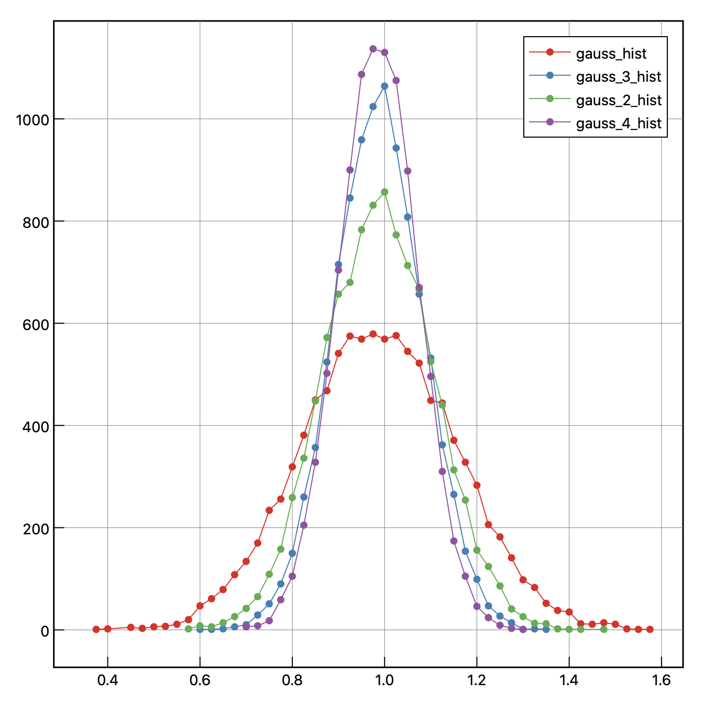

# 正規分布を作りたい？？
- 統計の勉強
- 中心極限定理について、実例を元に確かめる
    - 一様分布の平均をとることで、ガウス分布になることをみる
    - 平均の数（標本のサイズ）をあげることで、標準偏差が小さくなるのをみる

## 中心極限定理
- [wiki](https://ja.wikipedia.org/wiki/%E4%B8%AD%E5%BF%83%E6%A5%B5%E9%99%90%E5%AE%9A%E7%90%86)の説明
> n が十分大きいとき近似的に、部分和 $S_n = X_1 + … + X_n$ は平均 $n\mu$, 分散 $n\sigma^2$ の正規分布 N($n\mu$, $n\sigma^2$) に収束し、標本平均 $\bar{X_n}=(X_1 + … + X_n)/n$ は平均 $\mu$, 分散 $\sigma^2/n$ の正規分布 N(μ, $\sigma^2/n$) に従う。

- 標本のサイズ $n$ の大きさによらず、標本平均は $\mu$ であるが、標準偏差は $1/\sqrt{n}$ で小さくなることを示している。

### つまり？
- サイコロを多く振れば降るほど、平均値は3.5に近づいていく（ばらつきがなくなる）
- これは（この、ばらつきが小さくなるという性質）、母分散の確率分布によらない

## 一様分布の作成
- 0-1の一様分布を作成する（小数点以下５桁）
    - /dev/urandom でランダムなバイト列を表示
    - そこで、数字以外を tr を使って削除
    - ５桁ごとに折り返して
    - 先頭に"0."をつける
    - 完成
```
cat /dev/urandom | LC_ALL=C tr -dc 0-9 | fold -w 5 | sed 's@^@0.@' 
> 0.38092
> 0.13855
> 0.90732
> 0.28696
> ...
```

## 平均を取る

### 6個ずつ横に並べる
- `xargs`を使う
```
cat /dev/urandom | LC_ALL=C tr -dc 0-9 | fold -w 5 | sed 's@^@0.@' | xargs -n 6
```

### 横に並べた6個を平均を取る
- `awk`を使う
- ファイルに書き込む
```
cat /dev/urandom | LC_ALL=C tr -dc 0-9 | fold -w 5 | \
 sed 's@^@0.@' | xargs -n 6 | head -n 10000 | \
 awk '{for(i=0;i<=int(NF);i++){{if(i==0){a=0}else{a+=$i}}{if(i==NF){print 2*a/NF}}}}' > gauss
```

### そのファイルをヒストグラムにする
- 「0.1 ずつ刻むなら、下一桁までで切り捨てればいいじゃん」という発想
    - からの、より細かくするには X 倍して同じように切り捨てて、あとから 1/X すればいいじゃん、という発想
    - 下は X=6 の例
```
cat gauss | awk '{print substr(6*$0,1,3)/6}' | sort | uniq -c | awk '{print $2,$1}' > gauss_hist
```

- 平均を取る数を色々と変えてみた
    - 図示する
    - _n は、ノーマルの n 倍の数平均を取っている




