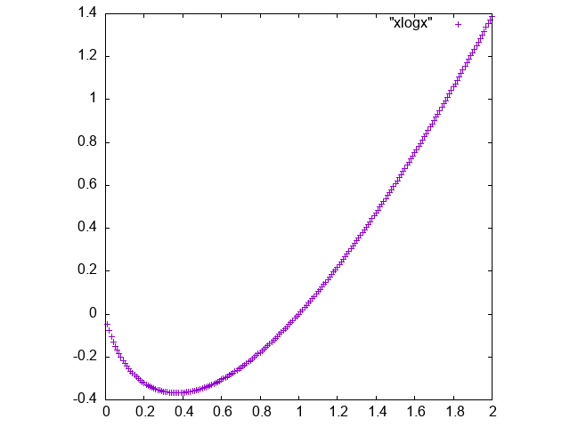

# ワンライナーで簡単なグラフ写真を生成する

- 以下の2つの流れで実行した
  - bcコマンドを用いた計算
  - gnuplotにつなげて、画像ファイルとして保存
- 結論のコマンドと、その時のグラフ
  - 以下はxlogxの計算を行なっている（"{} * l({})" の部分）
    - xlogxが0に収束するのが謎だなーと思い、図示してみた
```
seq 1 200 | sed "s@^@0.01*@g" | xargs -I{} sh -c 'echo {} | bc | tr "\n" "\t" && echo "{} * l({})" | bc -l' > ./xlogx \
 && gnuplot -e 'set terminal png; set size ratio 1; set output "./xlogx.png"; plot "xlogx"'
```




## bcコマンドを用いた計算
- bcの数値ライブラリ（option -l）を用いる
  - s(x) : sin(x)
  - c(x) : cos(x)
  - l(x) : log(x)
  - e(x) : exponential(x)
  - などが用意されている
  - 気になった方は`man bc | grep '\-l' -A20`で見てみるといいかも

### bcコマンドを用いて xlogx を計算する
- bcコマンドの使い方の確認

```bash
$ echo "2 * l(2)" | bc -l 
> 1.38629436111989061882
```

### xを生成する
- コンピュータには連続変数xなんてものは存在しない
  - seq を使って0.1刻みの、離散的な数値を生成する
- どうせ後からbcを通すので、とりあえず下のように生成
```bash
$ seq 1 20 | sed "s@^@0.1*@"
0.1*1
0.1*2
0.1*3
0.1*4
...
```

### yを生成する
- 上で作られたxに対して、xlogxの計算を行なってやる
  - xargsを用いて、echoの引数に指定
```bash
$ seq 1 20 | sed "s@^@0.1*@" | xargs -I@ echo '@ * l(@)'
0.1*1 * l(0.1*1)
0.1*2 * l(0.1*2)
0.1*3 * l(0.1*3)
...

$ seq 1 20 | sed "s@^@0.1*@" | xargs -I@ echo '@ * l(@)' | bc -l
-.23025850929940456840
-.32188758248682007492
-.36119184129778079778
...
```

### x,y をタブ区切りで表示
- プロットさせるときの関係で、xとyをタブ区切りで並べて表示させる
```bash
$ seq 1 20 | sed "s@^@0.1*@" | xargs -I@ sh -c 'echo @ | bc | tr "\n" "\t" && echo "@ * l(@)" | bc -l'
.1	-.23025850929940456840
.2	-.32188758248682007492
.3	-.36119184129778079778
.4	-.36651629274966202607
```


## gnuplotにつなげてあげて、pngファイルを生成する
- `xlogx` というファイルが存在する場合の、ワンライナーでのpngファイルの生成の仕方は以下
  - 設定を読んでもらえれば、なんとなくやってることはわかると思う

```
gnuplot -e 'set terminal png; set size ratio 1; set output "./xlogx.png"; plot "xlogx"'
```

- これを用いると、最終的に以下のような流れでグラフを生成することができる
  - 今までのコマンドを用いてxlogxというファイル（xlogx）を生成
  - その後に上のコマンドを用いてpngファイル（xlogx.png）を生成


## 最後に
「え、こんなのgnuplotとかpythonとかでxlogx書いた方が早いじゃん」という声が聞こえてきそうですが無視することとします

いつか役立つ時がくるでしょう


## tag
linux, ワンライナー
