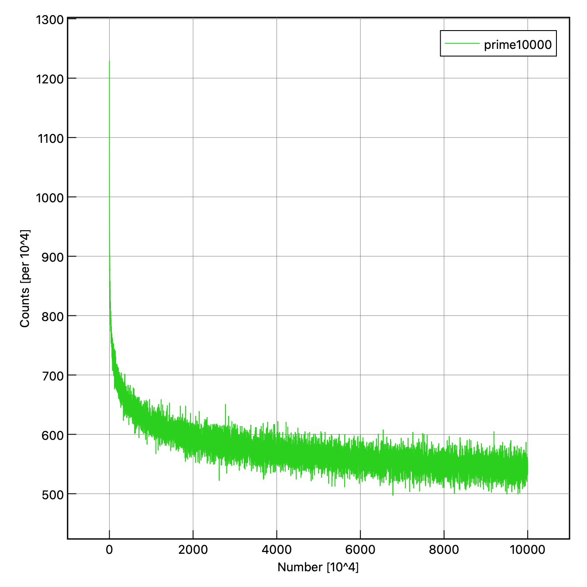
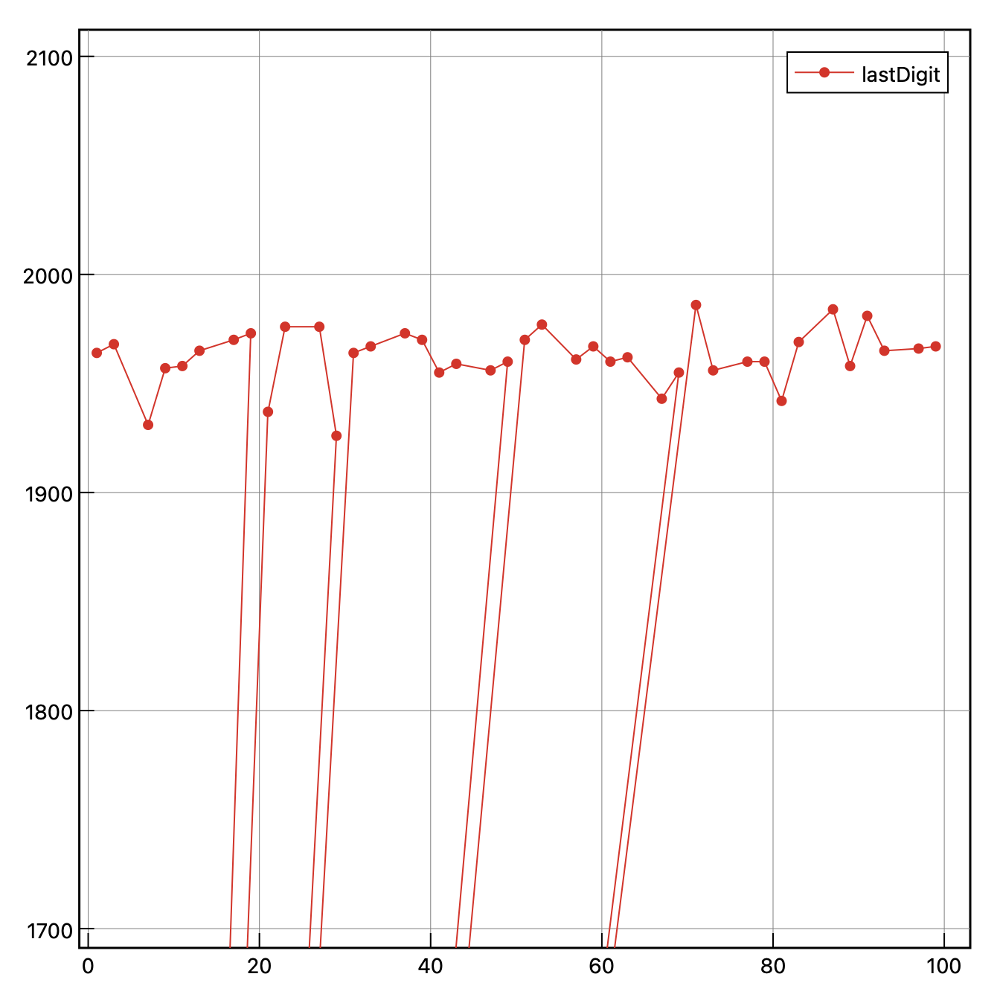

# 素数遊び
- 素因数分解`factor`コマンド（linux）
- macでは`gfactor`を使う
    - `brew install coreutils!`

## gfactor
```
gfactor 144
> 144: 2 2 2 2 3 3
gfactor 149
> 149: 149
```

### 素数を取り出す
この中で２行のもの＝素数、という判定方法
```
gfactor 149 | awk 'NF==2{print $2}'
> 149
```

### 1000以下の素数一覧を取り出す
```
seq 2 1000 | gfactor | awk 'NF==2{print $2}'
```


## 素数の現れる割合は数の大きさによってどう変わるか
- 検証
    - 0-10000までにある素数の数と、10001-20000にある素数の数に違いはあるのか
    - ワンライナーで実行

### 10000以下の数に含まれる素数の数
```
seq 2 10000 | gfactor | awk 'NF==2{print $2}' | wc -w
```

### あとは上を繰り返すだけ
- 下の例は、100万までを1万刻みでチェックしている
```
for i in {0..99}; do seq $((10000*$i)) $((10000*($i+1))) | gfactor | awk 'NF==2{print $2}' | wc -w; done
```

### 100万より大きい数の"seq"には注意
- macの場合、1000000より大きい数をseqで流すとデフォルトでは丸め込まれちゃう
    - オプション指定が必要
```
seq 1000000 1000001
> 1e+06
> 1e+06
seq -f %f 1000000 1000001
> 1000000.000000
> 1000001.000000
```

- このままでは`factor`に流せないので、小数点以下を削除
```
seq -f %f 1000000 1000001 | sed 's@\..*@@'
> 1000000
> 1000001
```

### ファイルに出力してプロット
```
for i in {0..99}; do seq $((10000*$i)) $((10000*($i+1))) | gfactor | awk 'NF==2{print $2}' | wc -w >> prime; done
```


- グラフの描画には[mjograph](https://www.mjograph.net/indexj.html)を使った


## 素数の下２桁の性質についてチェック

### 素数の下２桁のみ取り出す
- awkを用いる（substr, length）
```
gfactor 101 | awk 'NF==2{print $2}'
> 101
gfactor 101 | awk 'NF==2{print substr($2,length($2)-1,length($2))}'
> 01
```

### 出現回数を調べる
- sortした後に、`uniq -c`（ユニークカウント）でその回数を調べる
```
seq 1000 | gfactor | awk 'NF==2{print substr($2,length($2)-1,length($2))}' | sort | uniq -c
```

### ファイルに出力してプロット
- 100万以下の数について、素数下２桁の出現回数を調べた
- カウントと出現回数を入れ替えてある（プロットのしやすさのため）
```
seq 2 1000000 | gfactor | awk 'NF==2{print substr($2,length($2)-1,length($2))}' | sort | uniq -c | awk '{print $2,$1}' > lastDigit
```


### 結果
- ほぼ一緒！

